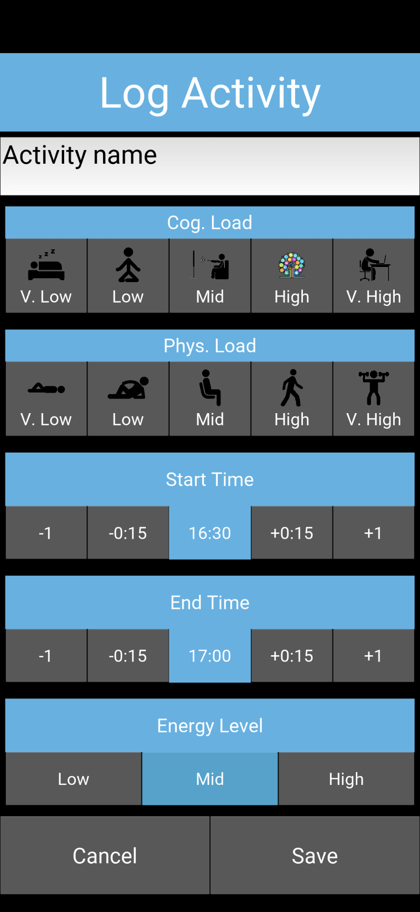

# Spoon Calculator
An Kivy app that tracks energy expenditure throughout the day and helps users identify correlations between behaviour and energy.

This app is aimed for people with limited energy, who struggle to recognise (and thus not overstep) their limits, since the consequenting symptoms for overstepping these limits are difficult to measure.

Spoon Calculator allows users to log activities throughout the day, approximating the energy used for each activity using the metaphor of ["spoons"](https://en.wikipedia.org/wiki/Spoon_theory). Users are provided with a plot of the day's energy expenditure so far, as compared with recent days. This gives users an immediate comparison to previous days, a projection for the remainder of the day, and an indication for the variance from day to day.

Equipped with this knowledge, the user will hopefully be able to identify patterns between the type or amount of activities and any severe symptoms they may consequently experience.

## Home screen
The home screen displays a plot of the current day's energy expenditure so far and provides access to all features.

<!--- 
-->

The fraction at the top shows "number of spoons spent so far" over "total spoons spent per day averaged over past 14 days".

The plot shows the day's spoon expenditure compared to the past 14 days. The x-axis is the time (beginning and ending at 3am), the y-axis is "spoons". The spoons spent so far today are shown in yellow. The red lines show the spoons spent so far each day, averaged over the past 14 days (thick), plus and minus one standard deviation (thin).

This plot encapsulates a lot of useful information. The yellow line being signicantly above (or below) the thick red line can indicate if the user should rest (or be more active). The thin red lines provide a guide of how far from the mean the yellow line should stray, and also allow for rough extrapolation by eye. The distance between the thin red lines indicate consistency from day to day.

Below the plot are buttons that lead to all available interactions.

## Log an activity

This view is used to log activities throughout the day, whether that be every single activity, or just the ones of particular interest to the user. The user may provide an informative name, the "cognitive load", the "physical load", and beginning and end times with a 15 minute resolution. The current energy level may also be provided.

The physical and cognitive loads describe how many spoons an activity costs. Each load can be as "cheap" as 0 spoons per hour, or as expensive as 2 spoons per hour, with an increment of 0.5 spoons per hour between each level. For example, an activity that is very high physical load but only high cognitive load will cost (2 + 1.5) 3.5 spoons per hour. If this activity is performed for two hours, a total of 7 spoons will be logged. It is up to the user to decide where on the scale each activity falls, but to aid consistency graphics are provided. From experience, this scaling system leads to a two digit daily spoon total.

Upon pressing "save" the data will be stored in a locally stored database. This data can be deleted via the "Show logs" view (see below).

## Plot

On top of the plot featured in the home screen, various other plots are available. One can choose a time span from daily, weekly or monthly. The daily plots use the same axes units as the plot on the home screen. The weekly and monthly plots' x-axis denote days, with today being 0, yesterday being -1, etc.

## Show logs
Here one can see all the logs stored in the database. All activities for a given day are listed, along with their loads and spoon cost. In the event of an erroneous input, a checkbox at the right of each row can be used to mark an activity for deletion.

## Export logs
The user may export the database as a CSV (comma seperated value) file. The file will be saved in the default android "internal storage" directory with the name "spoon-output.csv". This feature is useful to carry data across reinstallations (see "Import logs") or if the user wishes to analyse the data themself in a more nuanced way.

Warning! This feature does not check for overwrites, so if the database is empty (e.g. you've just reinstalled the app) it will overwrite any previous export.

## Import logs
A previously exported database of logs may be re-imported. The user may provide a custom filename (as a relative path from default android internal storage). The app supplies a default filename which is identical to the one used for exporting.

When importing duplicates are skipped, such that importing the same export twice won't lead to duplicates of every logged activity.
